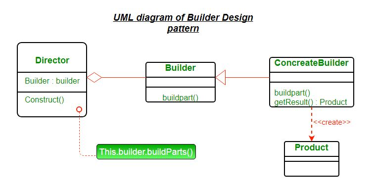

### Factory Design Pattern

It is usually used when many fields are optional in a class. 
It helps keep constructor limit it's arg count + helps limit number of constructors.

- Director is used to orchestrate and decide order in which to build

HomeBuilder Output:

Person Builder (Using Spring Boot)

We need to keep copy of variables in Builder as well as main class.

---
Pending:
How is this different from Decorator design pattern?