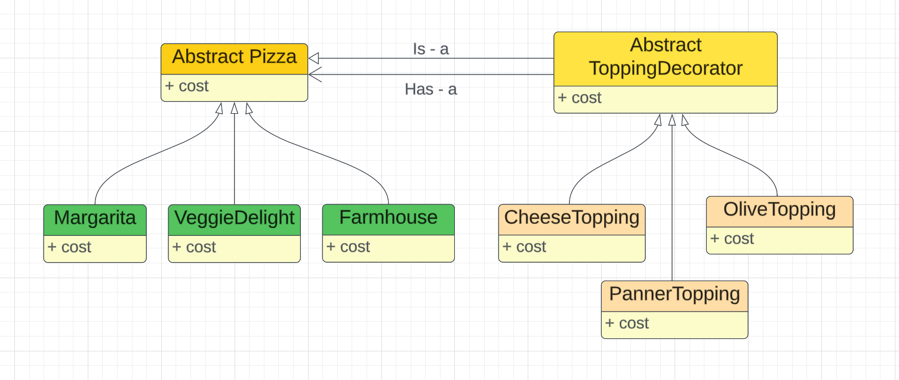

### Decorator Design Pattern
- It helps us add new features to existing object without altering its structure.
- It provides a wrapper to existing class.

Note:
- Decorator design pattern is useful in providing runtime modification abilities and hence more flexible. Its easy to maintain and extend when the amount of choices are more.
- Decorator pattern is used a lot in Java IO classes, like FileReader, BufferedReader, etc.

#### This pattern helps us from class explosion.


Cruz of this pattern is decorator is a base class and has a base class. Hence it becomes extensible.

More toppings can easily be added.

Output:
```agsl
Cost of Veggie Delight + Cheese & Olive toppings is 230
Cost of farmhouse with Cheese and Olive toppings is 195
Cost of MargaritaPizza with Panner topping is 200
```

---
Ref:
- https://www.youtube.com/watch?v=w6a9MXUwcfY