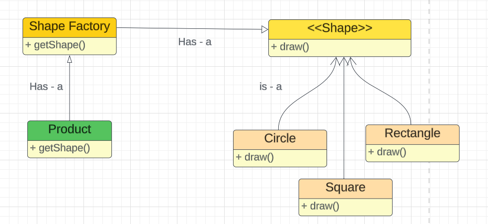

### Factory Design Pattern

Allows client create a object with properties based on the conditions.


- Separates creation logic from the client code.

```agsl
Drawing a Circle
Drawing a Rectangle
Drawing a Square
```

Abstract Factory Pattern means we have factory of factories.
Ex. We have a Polygon factory, Line factory, dot factory. We can 
create on more factory names maths factory which returns polygon factory, 
line factory, ...

ex. 
- JDBC uses it to create connections, statements and result sets.
- Logging by Log4j and Logback


---

Ref: 
- https://www.youtube.com/watch?v=7g9S371qzwM