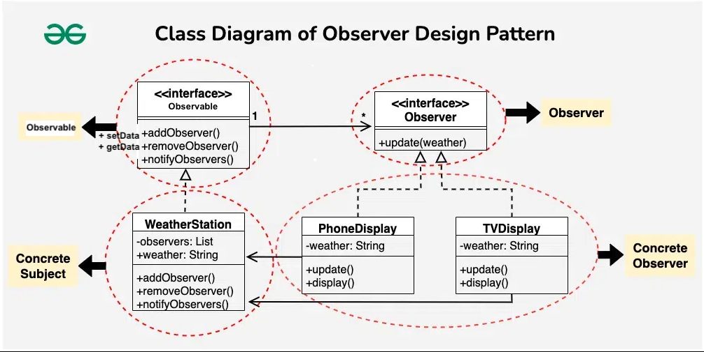

### Observer Design Pattern

This is used when one Observable needs to be subscribed by many Observers.
It primarily deals with the interaction and communication between objects, 
specifically focusing on how objects behave in response to changes in the state of other objects.



#### Why is setData and getData needed in Observers?
--> We can add custom logic on when to set data... And even if we set data do we want to call observers.

Code Output:
```agsl
Phone Display: Sunny
Computer Display: Sunny
Phone Display: Cloudy
Computer Display: Cloudy
Phone Display: Rainy
Computer Display: Rainy
```

Ex.
- Notify customers when a product is available.
- Notify devices when weather is changed
- Notify Employee when their Management hierarchy is changed


---

Ref:
