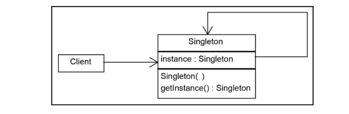

### Singleton Design Pattern

Singleton Design Pattern ensures class can have only one instance, and provides a global point of access to it.

Advantages:
- In scenarios where a single point of control is needed to avoid naming conflicts or collisions, the Singleton pattern ensures that there is only one instance with a unique name.
- Reduced memory footprint by ensuring that there is only one instance of the class.

Disadvantages:
- Not recommended as we are not sure if we may need this object as not singleton in futute
- Singletons introduce global state, unit testing can become challenging. Testing one component in isolation may be more complicated if it relies on a Singleton, as the state of the Singleton may affect the outcome of tests.

#### How to break singleton design pattern?
1. Reflection: Reflection can be caused to destroy the singleton property of the singleton class.
2. Serialization: Serialization can also cause breakage of singleton property of singleton classes.
3. Cloning: Cloning is a concept to create duplicate objects. Using clone we can create a copy of an object.***
