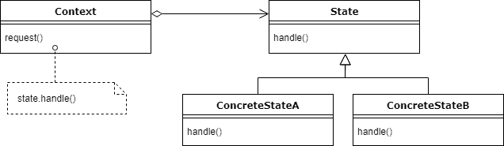
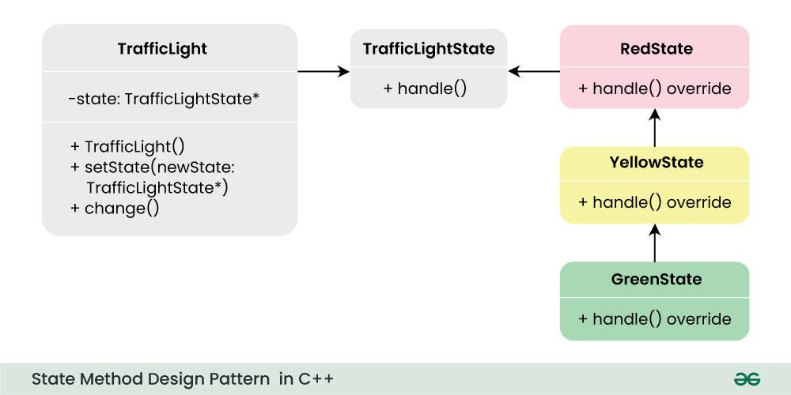
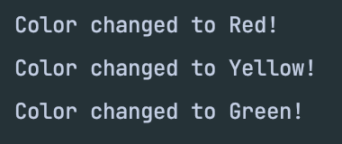

### State Design Pattern
Behaviour of object changes with change in state. This is implemented when each state has a set of 
methods and each state is triggered in a flow.

State Interface should contain all the methods needed by all the states. Only the class
needing the methods will implement logic other classes will throw exception.

Ex. 
- Vending Machine (IdleState, HasMoney, SelectSlot, Dispens
eItem)
- Traffic Light (RED, YELLOW, GREEN)
- Package (ORDERED, SHIPPED, DELIVERED)

Output:

Disadvantage: States will be hard coded.

---
Ref: 
- https://www.youtube.com/watch?v=wOXs5Z_z0Ew