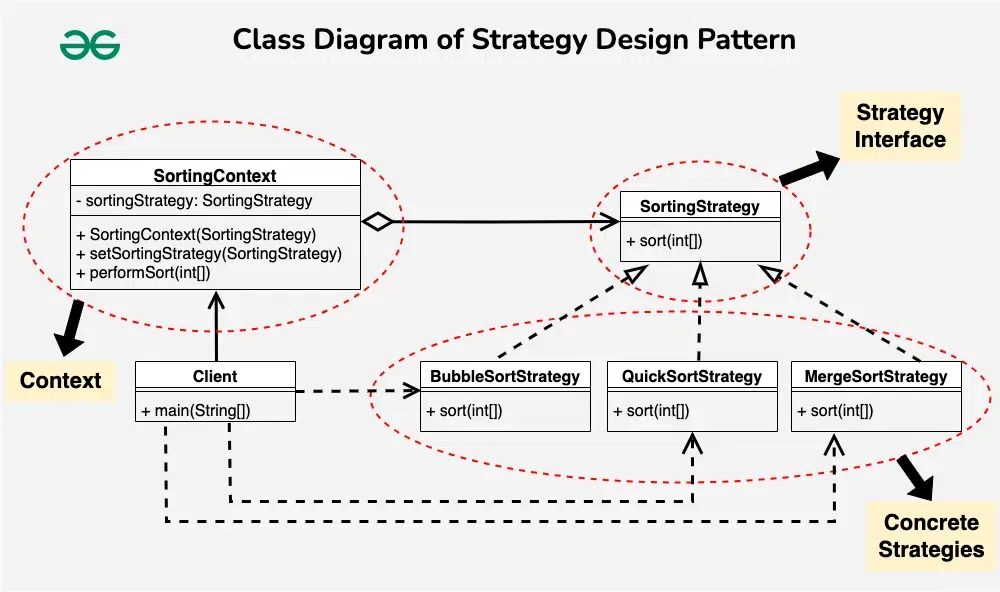

### Strategy Design Pattern

This design pattern can be used when there are multiple ways of doing something
Ex. Caching, Sorting, Data validation, payment processing...

The Strategy Pattern is used to define a family of algorithms,
encapsulate each one of them, and make them interchangeable. 
This pattern lets the algorithm vary independently of clients that use it.

---

Ref: 
- https://www.youtube.com/watch?v=u8DttUrXtEw
- https://www.geeksforgeeks.org/strategy-pattern-set-1/