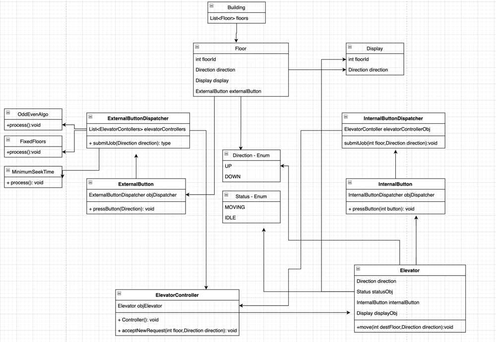

Elevator Management System
-
### Basics

- Divide the problem into two parts
  - Algo - Strategy Design Pattern can be used
  - Core classes (Controller + Basic class)
    - ex. Elevator + Elevator Controller
    - ex. External Button + External Button Dispatcher
    - ex. Internal Button + Internal Button Dispatcher

**NOTE:**
- Each external Button has a external button dispatcher
- Each external button dispatcher has a list of lift controllers to control every lift

### Possible Algorithms:
- **Elevator Algorithm** (Move from 1st floor to last then last to first)
- **Look Algorithm** (Max Heap + Min Heap + Pending Job list)
Logic if dir = UP and cur_floor < req_floor add floor to MIN Heap.
And stop at all places stored in MIN Heap.
else add in PEND_JOB
- **Min Seek Time** Get the closes elevator available.